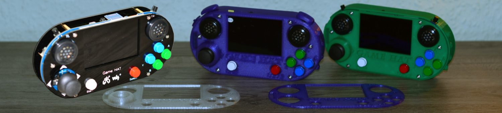
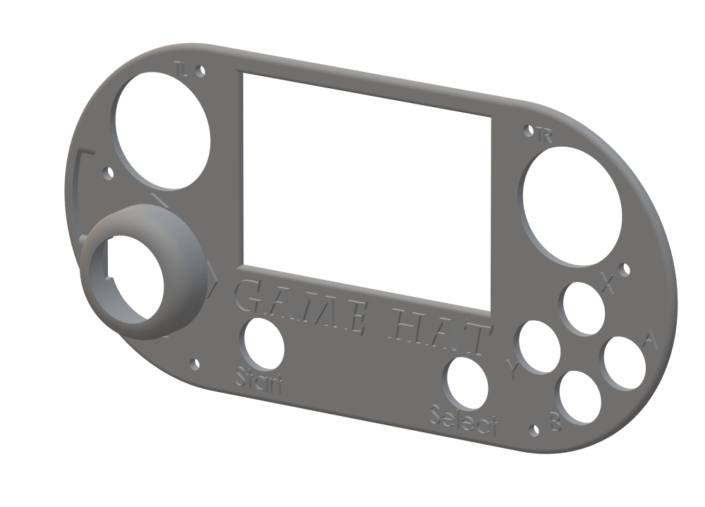
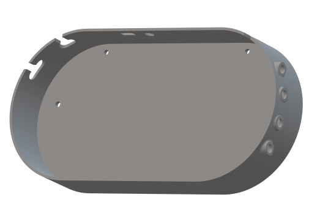
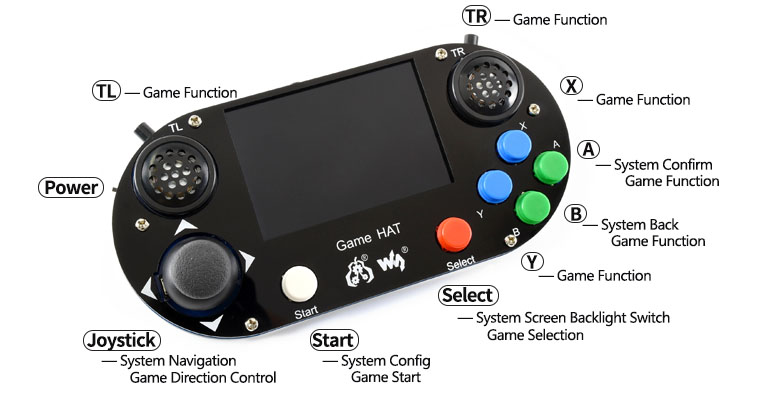

# Waveshare Game HAT printed Case #

---

##Game Hat Cases Download

Nachfolgend wieder die erste Revision des gedruckten Gehäuses für die Waveshare Game Hat Platine als STL kostenlos downloadbar sein.

Der Gehäuse Deckel steht in 3 verschiedenen Versionen zur Verfügung.

Einmal mit 1mm herausgestellter Schrift, zum anderen mit 1mm versenkter Schrift und einmal komplett ohne Schrift.

#####Game Hat Case Oberseite

<a href="./Oberteil-mit-Gehaeuse-mit-Schrift-1mm.STL">Oberteil-mit-Gehaeuse-mit-Schrift-1mm.STL</a>
<a href="./Oberteil-mit-Gehaeuse-mit-Schrift-versenkt.STL">Oberteil-mit-Gehaeuse-mit-Schrift-versenkt.STL</a>
<a href="./Oberteil-mit-Gehaeuse-ohne-Schrift.STL">Oberteil-mit-Gehaeuse-ohne-Schrift.STL</a>

Dies ist die Rückseite mit Aussparungen für die 4 Knöpfe zum einstellen der Waveshareplatine (Helligkeit, Kontrast, Lautstärke etc.), den beiden Schultertasten, USB-Eingang und Klinkenausgang als auch dem Power-Schalter

#####Backside Waveshare Game Hat Case

<a href="./Unterteil-geschlossen.STL">Unterteil-geschlossen.STL</a>

#####Zu guter Letzt die Kleinteile:

Buttons for Waveshare Game Hat

<a href="./Button-1-2.STL">2x Button-1-2.STL</a>
<a href="./Button-3-4.STL">2x Button-3-4.STL</a>
<a href="./Button-Power.STL">1x Button-Power.STL</a>
<a href="./Buttons-Hinten.STL">2x Buttons-Hinten.STL</a>

---

